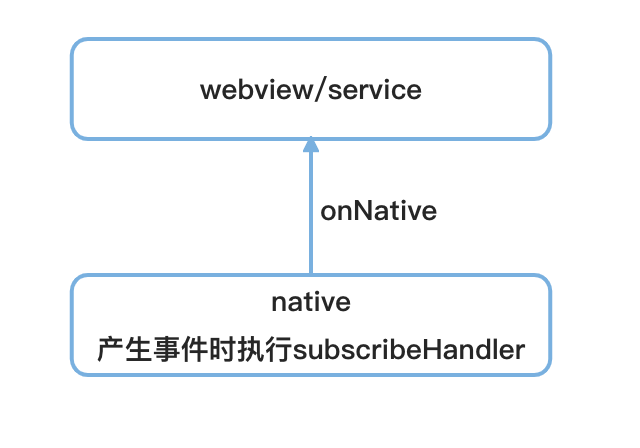

## 小程序中JSBridge的实现

### JSBridge的介绍
> todo...
- 背景
- 演变
- 现状
- iOS和Android端的分别实现

```js
let jsCore;
/* Android端注入 */
if (self.JSCore) {
  jsCore = JSCore;
} 
/* iOS端 */
else {
  const messageHandlers = self.webkit.messageHandlers;
  jsCore = {
    call: function(method) {
      messageHandlers.JSBridge.postMessage()
    },
    publish: function() {

    }
  }
}

```

### 根据小程序特点实现JSBridge

小程序从底层实现来看小程序和h5唯一的区别，是将视图和逻辑隔离形成了双线程，jsb需要承载线程之间的通信功能，其实就是纯粹的转发能力。

jsb主要可以分为：

调用类：

- 调用native能力[1]
- 调用线程[2] （逻辑层->渲染层、渲染层->逻辑层)


监听类：

- 监听native事件[3]
- 监听线程[4]



回调类：由native执行调用，一般不暴露给使用者

- 调用native能力[1]后的回调
- 监听事件的回调[5]，消息包含监听native事件[3]的回调、监听线程[4]的回调


所以简单实现如下：

```js
function createInvoke(jsCore) {
  let resolveId = 0; // 调用唯一标识
  const resolveMap = new Map();

  /* 调用native能力[1] */
  function invokeNative(method, params, webviewId) {
    let response;

    const deferred = new Promise((resolve, reject) => {
      resolveId+=1;
      resolveMap.set(resolveId, resolve}); // 暂不考虑失败情况

      const paramsString = JSON.stringify(params);
      const webviewIds = Array.isArray(webviewId) ? webviewId : [webviewId];
      const webviewIdsString = JSON.stringify(webviewIds);

      response = jsCore.call(method, paramsString, webviewIdsString, resolveId);
    })

    /* 有结果为同步api */
    if (response) {
      resolveMap.delete(resolveId);
      return JSON.parse(response);
    }
    /* 异步api */
    return deferred;
  }

  /* 调用native能力[1]后的回调 */
  function invokeHandler(resolveId, data) {
    const resolve = resolveMap.get(Number(resolveId));
    if (!resolve) return;

    resolve(JSON.parse(data));
  }

  return {
    invokeNative,
    invokeHandler
  }
}

function createPublish(jsCore) {
  /* 调用线程[2] */
  const publish = (method, params, webviewId) => {
    const paramsString = JSON.stringify(params);
    const webviewIds = Array.isArray(webviewId) ? webviewId : [webviewId];
    const webviewIdsString = JSON.stringify(webviewIds);

    jsCore.publish(`${CUSTOM_EVENT}${method}`, paramsString, webviewIdsString, g.__IS_WORKER__);
  };

  return {
    publish,
  };
}

function createSubscribe() {
  const nativeEmitter = new EventEmitter();
  const customEmitter = new EventEmitter();

  return {
    /* 监听native事件[3] */
    onNative: nativeEmitter.on.bind(nativeEmitter),
    offNative: nativeEmitter.off.bind(nativeEmitter),
    /* 监听线程[4] */
    subscribe(event, listener) {
      customEmitter.on.call(customEmitter, `custom_event_${event}`, listener);
    },
    unsubscribe(event, listener) {
      customEmitter.off.call(customEmitter, `custom_event_${event}`, listener);
    },
    /* 监听事件的回调[5] */
    subscribeHandler(event, data, webviewId) {
      let params = JSON.parse(data);

      if (event.startsWith('custom_event_')) {
        customEmitter.emit.call(customEmitter, event, params, webviewId);
      } else {
        nativeEmitter.emit.call(nativeEmitter, event, params, webviewId);
      }
    },
  };
}

```

### 总结

所以上面实现后的jsb，对使用者暴露的方法为：

- invokeNative
- onNative
- offNative
- publish
- subscribe
- unsubscribe

invokeHandler和subscribeHandler挂载到全局，供native调用使用。

### 参考资料

- [H5和Native交互原理](https://github.com/quickhybrid/quickhybrid/issues/10)
- [JSBridge的实现](https://github.com/quickhybrid/quickhybrid/issues/9)
- [EMP通信机制](https://zhaomenghuan.js.org/blog/what-is-emp.html#%E9%80%9A%E4%BF%A1%E6%9C%BA%E5%88%B6)
