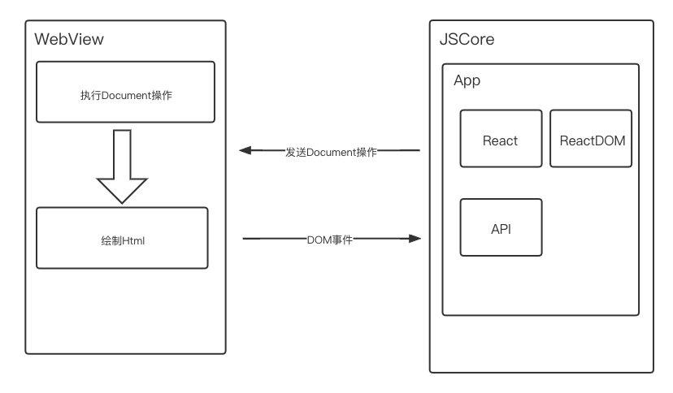
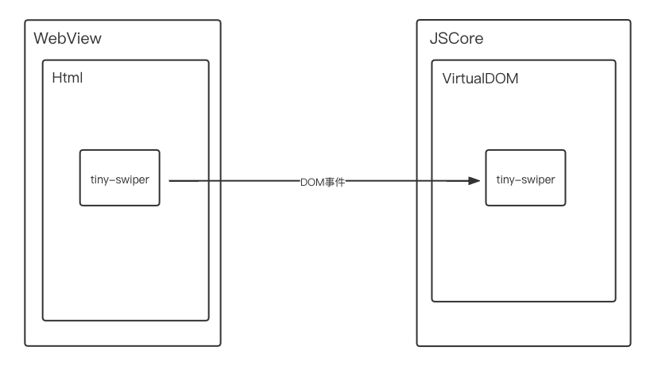
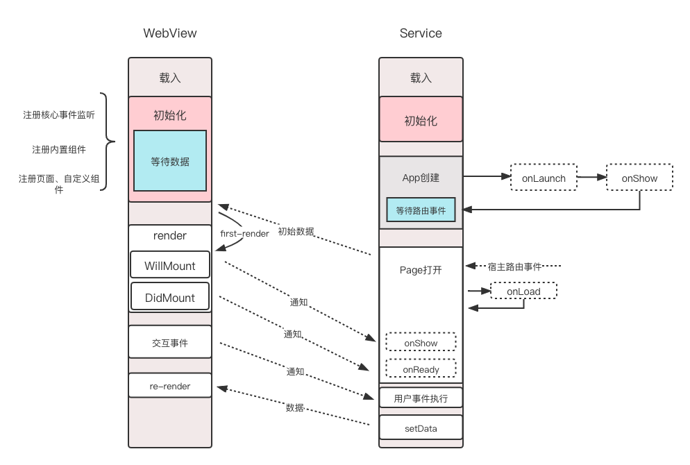

# 关于小程序的探索

## 开始的方案

当时公司准备开始内部自研小程序技术方案，整个开发方式都是和wx小程序保持一致的，业务开发是也是模版、样式、逻辑、配置等等，基本确定了对外的接入方式。

由于在此之前已经有一版hybrid方案采用的也是双线程方案，业务逻辑层和视图渲染层隔离，从这个视角看架构与小程序是一样的。但是它的逻辑层其实又与小程序不太一样，逻辑层做的事情比较多，把整个应用的执行全部放在了逻辑层，形象的比喻那就是一个webview版渲染的ReactNative😓。




因此这版小程序的最终运行机制是要往hybrid上靠，通俗易懂的解释就是将小程序硬转译为React，对小程序一直保持一些关注所以第一时间想到的就是Taro，记得Taro有个[convert功能](https://taro-docs.jd.com/taro/docs/taroize)大致符合需求将小程序转成类React，小程序整体方案基本定了，后面可以开始着手踩其中的坑了。

## 遇到的问题

- 静态转译不能解决的问题

taro的convert功能没有覆盖所有的小程序写法，比如template深度嵌套、template传值方式等等问题，这些问题其实还好可以魔改一下。

业务代码中的Page、Component等函数调用语法是转译的关键语法，一旦业务方的小程序使用了类似wepy这样的第三方框架，或者自己封装了Page、Component等函数调用，静态转译将在指定代码中找不到关键字。因此静态转译不是银弹，这一版小程序对业务开发者使用上存在很大的限制，并不是一个标准的小程序方案。

```js
// myPage.js
function myPage(config) {
  // do sth
  Page(config)
}

// page1.js
import myPage from '@common/myPage'

myPage({})
```

- 逻辑层过重

将整个React应用全部放在了逻辑层，其中也包含了内置组件，这样带来了一些问题。

原本内置组件是受信任的，由于也在逻辑层中，导致这些组件也受到了DOM、BOM的限制，自己硬给自己设了一道坎。为了让内置组件恢复正常能力，逻辑层的内置组件可以不去实现具体的功能，只负责事件的接收传递，在渲染层通过web-component去实现一个具体功能的组件。

这种方式对于框架开发者来说体验还是太差了。



因此这个方案不是一个可持续发展的方案，需要改变一下方向。

## 再次探索小程序

经过上一阶段的踩坑，基于taro做小程序的运行时方案肯定是不太正确的。因此想做小程序就得与业界对齐，探索业界是怎么实现的。

小程序整体架构主要由基础库、编译器、宿主容器组成

 


### 渲染层

**主要职责：** 承载模版和样式的展示功能

**包含模块：** UI框架、内置组件

- UI框架： React、Vue等目前主流框架
  * 微信小程序Exparser（未开源）
  * 支付宝小程序React
  * 百度小程序swan.js
  * 字节小程序Yaw 类React（未开源）

- 内置组件：
  * 基于UI框架实现
  * 基于web-component实现（字节小程序基于Polymer）

### 逻辑层

**主要职责：** API提供、核心逻辑执行以及路由/事件管理

**包含模块：** 
  - App、Page以及Component等通用方法
  - 路由
  - API

### 例如支付宝小程序

webview渲染基于React、React-DOM，内置组件为React组件。

业务代码的模版文件与样式文件会打包到webview，例如：

```js
// index.webview.js
Component({
  usingComponents: {
    
  },
  get render() {
    return require('root/components/a/a.axml')
  },
  get style() {
    return require('root/components/a/a.acss')
  }
})

Page({
  usingComponents: {
    'com-a': 'root/components/a'
  },
  get render() {
    return require('root/pages/index/index.axml')
  },
  get style() {
    return require('root/pages/index/index.acss')
  }
})

```

业务代码的逻辑文件会打包到service，例如：

```js
// index.service.js
require('root/app.js');
require('root/components/a/a.js');
require('root/pages/index/index.js');
```

## 实现

### 选型
UI框架的选择使用比较熟悉React，内置组件部分期望做到比较纯粹、隔离，所以web-component是合适的选择，为了组件开发方便选择了Polymer。

### 自定义渲染器
先看下小程序源码到最终处理后能运行的产物是怎样的， 以页面文件举例：

**root/pages/index/index.wxml：**
```html 
<view style="width: 100rpx">
  <button class="btn" bind:tap="onTap">click</button>
</view>  
<custom-component></custom-component>
```

**root/pages/index/index.wxss：**
```css
.btn {
  color: red;
}
```

**root/pages/index/index.json：**
```js
{
  usingComponents: {
    "custom-component": "/components/custom-component/index"
  }
}
```

**biz/index.webview.js：**

```js
const jsx = (data, ctx) => {
  // 自定义组件的的加载
  const CustomComponent = ctx.resolveComponent('custom-component')

  return (
    <>
      <tiny-view style="width: 100rpx">
        <tiny-button class="btn" bind:tap={ctx.eventBinder('onTap')} >click</tiny-button>
      </tiny-view>
      <CustomComponent />
    </>
  )
} 

const css = () => `
.btn {
  color: red;
}
`

window.app['pages/index/index'] = {
  usingComponents: {
    "custom-component": "/components/custom-component/index"
  },
  render() {
    return jsx();
  },
  style() {
    return css();
  }
}

```

逻辑文件的编译过程中，为了能够在执行Page或Component调用时有对应的标识，可以执行前添加注册逻辑，如下：

**biz/index.service.js：**
```js
// 加载app.js
require('app.js')

// 加载自定义组件
$global.currentPageConfig = {
  is: "/components/custom-component/index",
  usingComponents: {}
};
require('components/custom-component/index.js')

// 加载页面
$global.currentPageConfig = {
  is: "pages/index/index",
  usingComponents: {
    ""
  }
};
require('pages/index/index.js')

```

同理自定义组件部分的编译处理也与上面类似。

到这里有没有注意到一个问题，tmplate转jsx后为什么style属性和事件绑定没有使用React的事件系统呢，这个问题其实一开始是React+ReactDOM实现的，但是后期完善的过程中被ReactDOM限制了很多，比如bind:longpress这样的事件在ReactDOM中没有一一对应的，这里需要自己实现一下[小程序事件系统](https://kms.netease.com/article/39017)以及style等属性的处理（如：rpx2px、样式作用域），具体方案可以使用react-reconciler编写一个[自定义渲染器](https://g.hz.netease.com/jiyufeng/custom-renderer)，也可以基于社区的mini React库修改渲染器部分，如基于Nervjs的实现成本就很低。

### 执行流程

小程序的业务代码最终运行产物已经定了，接下来在实现基础库之前，可以梳理一下小程序的整个运行过程。



### JSBridge

整个流程中可以看到小程序的双线程模型，涉及到大量的通信过程
- WebView -> Service
- Service -> WebView
- WebView -> Native
- Service -> Native

所以需要设计一套合适的[小程序JSBridge方案](https://kms.netease.com/article/41521)， 这是基础库的重要一部分。


## 参考资料
- [react-reconciler](https://github.com/facebook/react/tree/main/packages/react-reconciler)
- [nervjs](https://github.com/NervJS/nerv/tree/master/packages/nerv)
- [浏览器自定义事件](https://developer.mozilla.org/zh-CN/docs/Web/API/CustomEvent)
- [H5和Native交互原理](https://github.com/quickhybrid/quickhybrid/issues/10)
- [JSBridge的实现](https://github.com/quickhybrid/quickhybrid/issues/9)
- [EMP通信机制](https://zhaomenghuan.js.org/blog/what-is-emp.html#%E9%80%9A%E4%BF%A1%E6%9C%BA%E5%88%B6)
- [支付宝小程序](https://opendocs.alipay.com/mini/ide/overview)
- [字节小程序](https://microapp.bytedance.com/docs/zh-CN/mini-app/develop/developer-instrument/overview)