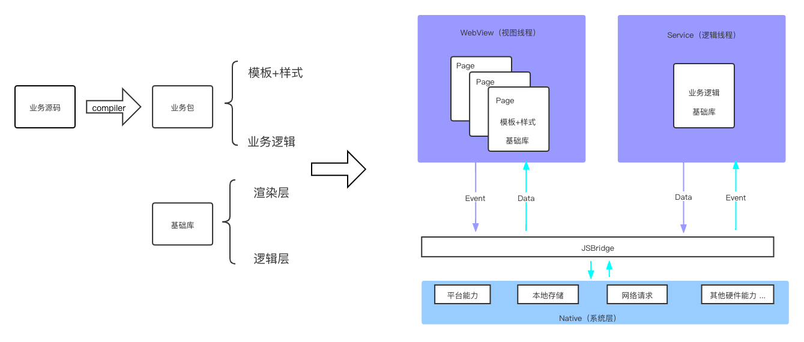

# 小程序之基础库篇

## 简介

小程序整体架构主要由基础库、编译器、宿主容器组成。

大致如下：

 

## 渲染层

**主要职责：** 承载模版和样式的展示功能

**包含模块：** UI框架、内置组件

- UI框架： React、Vue等目前主流框架
  * 微信小程序Exparser（未开源）
  * 支付宝小程序React
  * 百度小程序swan.js
  * 字节小程序Yaw 类React（未开源）

- 内置组件：
  * 基于UI框架实现
  * 基于web-component实现

## 逻辑层

**主要职责：** API提供、核心逻辑执行以及路由/事件管理

**包含模块：** 
  - App、Page以及Component等通用方法
  - 路由
  - API

**选型：** 
  - 使用熟悉的React作为UI框架
  - 内置组件期望不与框架耦合，所以选用基于web-component的Polymer作为组件开发框架

草稿纲要

- 介绍一下小程序是个啥，由哪些部分组成，每个部分都干了啥， 引经据典一下目前业界的实现

- 开始实现我的小程序，由结果反推出基础库配合编译器的实现，组件实现，调试工具的实现 electron、浏览器

- 难点
