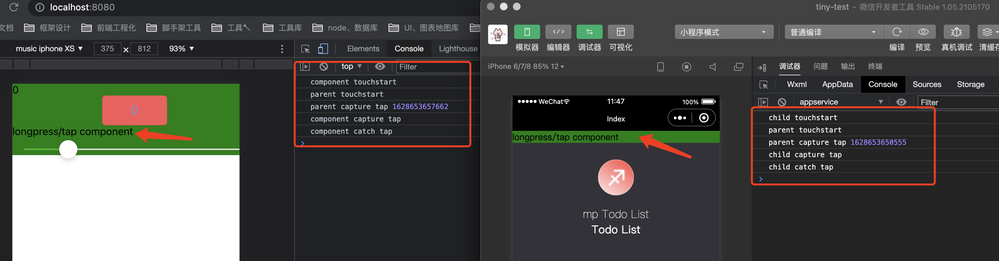

<!--
 * @Author: YufJ
 * @Date: 2021-08-16 11:45:06
 * @LastEditTime: 2021-08-16 16:21:25
 * @Description: 
 * @FilePath: /tiny-v1/packages/base2.0/src/framework/webview/docs/事件系统.md
-->

## 小程序事件系统

### 介绍

小程序中提供了一套自定义的事件系统， 事件支持有**tap**、**longpress**、**touchstart**、**touchmove**、**touchend**、**touchcancel**...， 支持**捕获阶段**、**冒泡阶段**、互斥事件等。

在使用方式上小程序的事件采用的是标签指令的方式：如

```html

<view bindtap="{{handleTap}}">
   <text>我是一个文本</text> 
</view>

<view catchtap="{{handleTap}}">
   <text>我是一个文本</text> 
</view>

<view capture-bind:tap="{{handleTap}}">
   <text>我是一个文本</text> 
</view>

```

从上面的使用方式可以看出，一个事件绑定指令中，会包含这些信息： **事件名**、**事件阶段**、**是否冒泡**等，虽然小程序的事件与现代浏览器中支持的事件很类似，但支持了tap、longpress这些浏览器中没有内置的事件，如何实现这样一套小程序事件系统呢。

### 探索

抛出问题：
- A1: tap、longpress的实现
- A2: 这样的事件系统如果在react这样的库中实现
<!-- - A3: 事件绑定用事件委托还是dom绑定呢 -->

Q1: 如果了解zepto的同学肯定很快就能大概知道tap、longpress事件的实现原理，基于touch事件的四个阶段就可以很好的实现。

Q2: 由于react的诞生初衷就是write once run everywhere，我们常用的react-dom是react针对浏览器环境的一个渲染器，react-dom、react-native这些适配器中都会依赖react的核心调度包react-reconciler，因此我们可以基于react-reconciler实现一个小程序渲染层的渲染器，实现对小程序的事件系统的支持。

<!-- Q3: 在A2的探索过程中会遇到一个问题，自定义渲染器中采用事件委托还是dom绑定？ -->

### 实践

开始实现自定义渲染器，由于自定义渲染器的实现不是很重要，有很多案例比如Remax中就有，可自行查阅。

下面主要详细介绍事件这部分的处理, 由于react的构建时babel插件的语法限制，不支持bind:tap这种带‘:’的jsx写法会有警告（虽然"throwIfNamespace": false可以关闭）, 我们这里默认在运行时拿到的prop都是不带‘:’, 编译时会处理掉。

1、处理event prop，在事件回调保存在dom

```js
const eventReg = /^(capture-)?(bind|catch)([A-Za-z_]+)/;

function isAnEvent(attr) {
  if (eventReg.test(attr)) {
    return true;
  }

  return false;
}

function patchEvent(eventName, lastEvent, nextEvent, domNode) {
  const { raw, name, options } = toEventName(eventName);
  const { capture } = options;

  const listener = domNode._listeners || (domNode._listeners = {});

  if (nextEvent) {
    listener[`${name}`] = listener[`${name}`] || {};
    
    if (!lastEvent) {
      const fn = eventProxy.bind(domNode, name, capture);
      // 事件绑定
      addListener(domNode, name, fn, options);
    }

    const displayName = nextEvent.name;

    listener[`${name}`][`${capture ? 'capture' : 'bubble'}`] = {
      options,
      handler: nextEvent,
      name: displayName,
    };
    domNode.setAttribute(raw, displayName);
  } else {
    // 回收事件
    listener[`${name}`][`${capture ? 'capture' : 'bubble'}`] = null;
    domNode.removeAttribute(raw);
  }
}

function toEventName(prop) {
  const matches = prop.match(eventReg);

  const capture = matches[1] === 'capture-';
  const stop = matches[2] === 'catch';
  const name = matches[3];

  const options = { capture, stop };

  return {
    raw: prop,
    name,
    options,
  };
}

```

2、 格式化包装event对象，并且处理是否阻止冒泡

```js
function eventProxy(name, capture, nativeEvent) {
  if (EVENT_BLACK_LIST.includes(name)) return false;

  let canBubble = true;

  const listener = this._listeners[`${name}`][`${capture ? 'capture' : 'bubble'}`];

  if (!listener) return;

  const event = wrapEvent(this, nativeEvent, name);
  // 处理冒泡
  if (listener.options.stop) {
    nativeEvent.preventDefault();
    nativeEvent.stopPropagation();

    canBubble = false;
  }

  listener.handler(event);

  return canBubble;
}

// 格式化event
function wrapEvent(node, nativeEvent, type) {
  const targetElement = nativeEvent.target;

  const target = {
    id: targetElement.id || '',
    dataset: targetElement._dataset || {},
  };
  const currentTarget = {
    id: node.id || '',
    dataset: node._dataset || {},
  };

  return {
    type,
    timeStamp: nativeEvent.timeStamp,
    target: {
      ...target,
      offsetLeft: targetElement.offsetLeft || 0,
      offsetTop: targetElement.offsetTop || 0,
    },
    currentTarget: { 
      ...currentTarget, 
      offsetLeft: node.offsetLeft || 0,
      offsetTop: node.offsetTop || 0,
    },
    detail: nativeEvent.detail,
    touches: getTouches(nativeEvent.touches),
    changedTouches: getTouches(nativeEvent.changedTouches),
  };
}
```

3、事件绑定

由于tap和longpress事件是由touch模拟的，所以在事件绑定时这两个事件所在的dom只需要执行一次touch四个阶段的绑定, 模拟tap事件注册时的touch事件都使用冒泡阶段

```js
// dom 事件名 绑定事件
function addListener(node, type, callback, options) {
  const { capture = false } = options;

  switch (eventType) {
      case 'tap':
        if (!node.__hasTapEvent) {
          node.__hasTapEvent = true;
          addTapEvent(node);
        }
    
        node.addEventListener('tiny-tap', (e) => {
          return callback.call(node, e);
        }, capture);
        return;
      
      case 'longtap':
      case 'longpress':
        if (!node.__hasTapEvent) {
          node.__hasTapEvent = true;
          addTapEvent(node);
        }
        node.addEventListener('tiny-longpress', (e) => {
          e.longpressFired();
          return callback.call(node, e);
        }, capture);
        return;
  }
}

function addTapEvent(node) {
  let pressTimer;
  let pressStart;
  let ended;

  const touchstartHandler = (e) => {
    // 解决tap事件多次调用的问题
    if (e.__handledTap) return;

    ended = false;
    pressStart = {
      x: e.touches[0].pageX,
      y: e.touches[0].pageY,
    };
    clearTimeout(pressTimer);
    pressTimer = setTimeout(() => {
      // 触发长按时间
      const pressEvent = new Event(`${elementPrefix}-longpress`, {
        bubbles: true,
        composed: true,
      });
      pressEvent.detail = pressStart;

      // 由回调执行设置结束，防止回调未执行成功
      pressEvent.longpressFired = function () {
        ended = true;
      };

      node.dispatchEvent(pressEvent);
    }, PRESS_DELAY);

    e.__handledTap = true;
  };

  // 主要用来判断tap结束和取消长按计时
  const touchmoveHandler = (e) => {
    if (ended || !pressStart) {
      return;
    }

    const dx = Math.abs(e.changedTouches[0].pageX - pressStart.x);
    const dy = Math.abs(e.changedTouches[0].pageY - pressStart.y);

    if (dx > TAP_DISTANCE || dy > TAP_DISTANCE) {
      ended = true;
      clearTimeout(pressTimer);
    }
  };

  const touchendHandler = (e) => {
    if (ended || !pressStart) {
      return;
    }

    ended = true;
    clearTimeout(pressTimer);
    // 如果没有触发touchmove的判断，这里还要再来一下
    const dx = Math.abs(e.changedTouches[0].pageX - pressStart.x);
    const dy = Math.abs(e.changedTouches[0].pageY - pressStart.y);

    if (dx > TAP_DISTANCE || dy > TAP_DISTANCE) {
      return;
    }

    // dispatch tap event
    if (node.disabled && TAP_BLACK_LIST.indexOf(node.tagName) !== -1) {
      // if element is disabled, 那就不触发了
      return;
    }

    const tapEvent = new Event(`${elementPrefix}-tap`, {
      bubbles: true,
      composed: true,
    });

    tapEvent.detail = {
      x: e.changedTouches[0].pageX,
      y: e.changedTouches[0].pageY,
      sourceEndEvent: e,
    };

    node.dispatchEvent(tapEvent);
  };

  const touchcancelHandler = (e) => {
    ended = true;
    clearTimeout(pressTimer);
  };

  node.addEventListener('touchstart', touchstartHandler);
  node.addEventListener('touchmove', touchmoveHandler);
  node.addEventListener('touchend', touchendHandler);
  node.addEventListener('touchcancel', touchcancelHandler);
}

```

### 最终效果

如下这样一段小程序代码，分别在react和微信中的执行结果表现一致

react模版
```js
<tiny-view 
      id="parent" 
      style="background: green;"
      capture-bindtap={() => { console.log('parent capture tap', Date.now())} }
      bindtap={() => { console.log('parent tap', Date.now())} }
      bindtouchstart={() => {console.log('parent touchstart');}}
      bindtouchmove={() => {console.log('parent touchmove');}}
    >
      <tiny-view
        capture-bindtap={() => { console.log('component capture tap');}}
        catchtap={() => { console.log('component catch tap');}}
        bindlongpress={() => {console.log('component longpress');}}
        bindtouchstart={() => { console.log('component touchstart');}}
        catchtouchmove={() => {console.log('component touchmove');}}
      >
        longpress/tap component
      </tiny-view>
    </tiny-view>
```

小程序模版
```html
  <view 
    id="parent" 
    style="background: green;"
    capture-bind:tap="pct"
    bindtap="pt"
    bindtouchstart="pts"
    bindtouchmove="ptm"
  >
    <view
      capture-bind:tap="cct"
      catchtap="ct"
      bindtouchstart="cts"
      catchtouchmove="ctm"
    >
      longpress/tap component
    </view>
  </view>
```



### 反思
其实这样的事件实现有一个bug存在，由于tap是通过touch来模拟的，当我们给某个标签同时绑定了touchstart和tap捕获、冒泡事件时，触发顺序是这样的：
```sh
touchstart
capture tap
tap
```
很明显的问题touchstart在tap捕获之前执行了...（这个问题微信小程序同样存在）


### 参考资料
字节小程序ide
